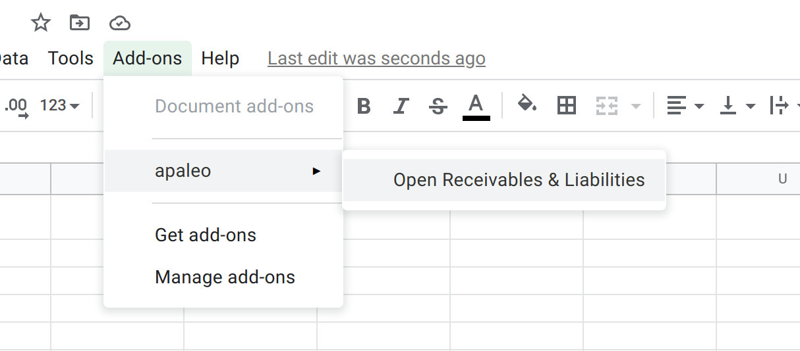
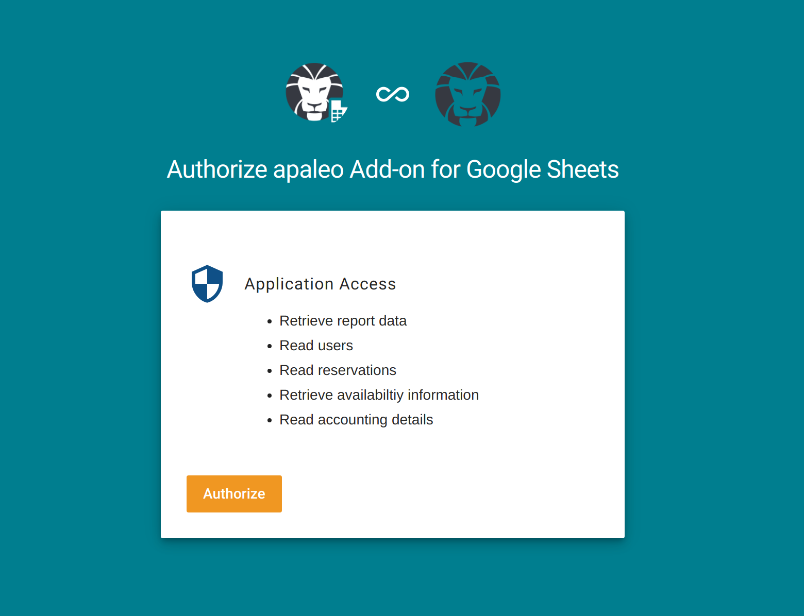
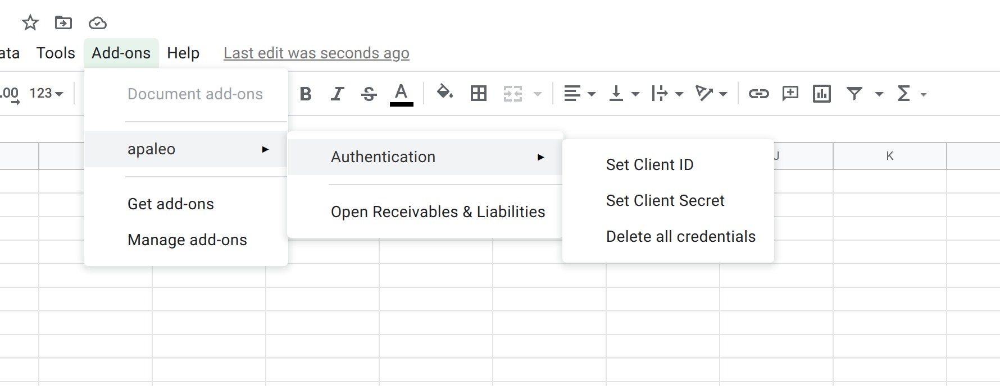

# apaleo for Sheets

An add-on for Google Sheets that creates custom reports using [apaleo API](https://api.apaleo.com/swagger/index.html).

## Open Receivables & Liabilities Report

Area of application: **Accounting**. This report shows reservations with the non-zero balance on the receivables or liabilities account. This report is build on top of the list of gross transactions for all reservations in the selected property (hotel) which period of stay lies between the specified "from" and "to" dates.


## Authorization

This add-on uses [Google OAuth2 library for Apps Script](https://github.com/googleworkspace/apps-script-oauth2) for authorization in apaleo and can work in two modes:
- [Authorization code grant flow](https://apaleo.dev/guides/start/oauth-connection/auth-code-grant) - when you install this add-on from the [Google Workspace Marketplace](https://workspace.google.com/u/0/marketplace).
- [Client credentials grant flow](https://apaleo.dev/guides/start/oauth-connection/client-credentials-grant) - when you fork this repo and develop a custom report on its base.


### Authorization code grant flow

To authorize in apaleo after the add-on is downloaded and installed from the Google Workspace Marketplace open the sidebar through the Add-ons menu and simply click on the "Sign in" button:




If the user installs the add-on in the first time, then he will see the apaleo consent screen with the request for accessing data in apaleo:



After authorization is completed the add-on will ask the [apaleo Identity Server API](https://identity.apaleo.com/swagger/index.html) for the current user's profile to determine which properties (hotels) the user has access to.


### Client credentials grant flow

This authorization mode works when users fork this repo and publish this code to their own Google App Script project. Read more below how to do it. With this mode in order to authorize in apaelo users have to create credentials in apaleo and provide Client ID and Client Secret through the Add-ons menu:



Read apaleo guides to learn how to creat credentials for a simple client:
https://apaleo.dev/guides/start/oauth-connection/register-app#register-the-oauth-simple-client-application

## Requesting data

All functions to retrieve data from apaleo API are defined in the `./src/ApaleoAPI.js` file. To create a new one use `getClient` and `getResponseBody` functions that take care about all auth and response handling details for you, for example:

```js
/**
 * Retrieves Reservation by Id.
 */
function getReservationById(id) {
   const url = `${apaleoApiUrl}/booking/v1/reservations/${id}`;

   const client = getClient();

   return getResponseBody(client.fetch(url, defaultOptions));
}
```

## User interface

UI is very simple and is built using the latest version of [Vue.js](https://vuejs.org/) framework and [Vue Material](https://vuematerial.io/) components from CDN. Which means that you don't need to pre-compile anything to see changes.

This add-on also uses the [intercom.js library](https://github.com/diy/intercom.js/)
to communicate between tabs / windows. Specifically, the callback page sends a
message to the sidebar letting it know when the authorization flow has
completed, so it can start updating its contents.


# How can I create my own report?

This code is published under the [MIT License](LICENSE) and it means that nothing can stop you from copying this repo, modifying the code and creating your own report. And you can do it manually or using the terminal.

## Manually

1. Create a new Google Sheet file using your google account.
2. Open the Script editor through the "Tools" >> "Script editor" menu in the new newly created google sheet file.
3. Copy the content of all files (except appsscript.json) from the `/src` directory to the Apps Script project.
4. Save the project.
5. Add the [Google OAuth2 library](https://github.com/googleworkspace/apps-script-oauth2) to the project. Libraries section is under the files in the Script editor. Library's Script ID is: `1B7FSrk5Zi6L1rSxxTDgDEUsPzlukDsi4KGuTMorsTQHhGBzBkMun4iDF`
6. Run the `onOpen` function from the `Main.js` file in the Script editor.

## Using Terminal

### Prerequisites:
- git
- yarn (or npm)

```sh
# Clone this repo
git clone https://github.com/apaleo/gsheet-addon.git gsheet-addon
cd gsheet-addon

# Install the dependencies
yarn install

# Authorize Clasp in your google account. Clasp is an official Google CLI for Apps Script projects.
# See the https://github.com/google/clasp for more info.
yarn clasp login

# Remove artifacts of the apaleo add-on's project
rm .clasp.json

# Create a new Apps Script project attached to a Spreadsheet.
yarn clasp create --type sheets --rootDir ./src --title THE_NAME_OF_THE_PROJECT
# After this command is done you'll see in the terminal the following output:
#
# Created new Google Sheet: https://drive.google.com/open?id=1L8******
# Created new Google Sheets Add-on script: https://script.google.com/d/1PGj******
# Done in 17.92s.
```

Open the fist link in the browser - the link to the new Google Sheet. Then execute the last command:

```sh
# Push files form ./src dir to apps script project
yarn clasp push
```

Return to the google sheet in the browser and open the Script editor via "Tools" >> "Script editor" menu. You should see all project files pushed to the editor together with the connected Google OAuth2 library.

Now you can run the `onOpen` function from the `Main.js` file in the Script editor.

## Troubleshooting

If you see `Exception: Cannot call SpreadsheetApp.getUi() from this context.` error in the execution log running `onOpen` function from the `Main.js`:


Most likely you have the Google Sheet document closed and you need to open it. Once you did it reopen also the Script editor through the "Tools" >> "Script editor" menu.

# How can I contribute?

This add-on is a non-commercial project with the open-source code, which goal is to ease the hoteliers life with the additional reports built using open API of the apaleo Platform. And we'd welcome any feedback, improvement or suggestion. To start the contribution:

1. Fork this repository.
2. Clone the forked repository to your machine.
3. Now create a branch.
4. Make necessary changes and commit those changes.
5. Submit your changes for review: go to your repository on GitHub, you'll see a `Compare & pull request` button. Click on that button.
6. Congrats! You just completed the standard fork -> clone -> edit -> pull request workflow that you'll encounter often as a contributor!
7. Celebrate your contribution and share it with your friends and followers!

# License

[MIT License](LICENSE)
